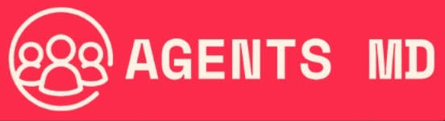

# **Agents MD**

  

Watching a loved one battle a disease is heartbreaking.

Watching them struggle in an overcrowded ER, waiting for care, is **devastating**.
 
Across the country, emergency rooms are in crisis—overcrowded, understaffed, and overwhelmed. Nurses face impossible workloads, making life-or-death decisions under extreme pressure, while patients endure agonizing delays in time-critical care.

Agents MD is transforming ER triage by addressing these urgent challenges. Our multi-agentic AI approach brings together competing AI models, each with specialized diagnostic expertise, to refine differential diagnoses in real time. By reducing diagnostic uncertainty and easing the burden on overworked nurses, we help accelerate patient care, enhance accuracy, and mirror the collaborative decision-making of medical teams—ensuring no patient is left waiting when every second counts.

## Our Solution

Agents MD leverages the power of large language models in a collaborative framework that mimics how medical professionals work together to reach consensus on patient care priorities. By combining multiple specialized AI agents, we create a system that is:

- **More accurate** than single-model approaches
- **Transparent** in its decision-making process
- **Supportive** of existing medical workflows
- **Responsive** to time-critical situations

## Check out our Demo

See our demo folder for a web-based demonstration of the Agents MD triage system in action.